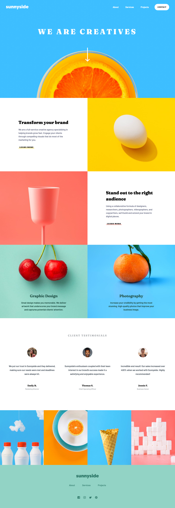

# Frontend Mentor - Sunnyside Agency Landing Page Solution

## The challenge

Users should be able to:

- View the optimal layout for the site depending on their device's screen size
- See hover states for all interactive elements on the page

## Screenshot

### Mobile


### Desktop



## Built with

- Semantic HTML5 markup
- CSS custom properties
- Flexbox
- CSS Grid
- Tailwind
- Mobile-first workflow
- JavaScript

## What I learned

I'm currently experimenting with Tailwind CSS and I wanted to try a larger project which includes a hamburger menu. I created some of my own 'themes' for properties such as font-families, colors and background images:

```js
/** @type {import('tailwindcss').Config} */
module.exports = {
  content: ["./docs/**/*.{html,js}"],
  theme: {
    extend: {
      screens: {
        'xs': '25em',
      },
      height: {
        'header-mobile': '33.625rem',
        'header-desktop': '50rem',
        'section': '37.5rem',
      },
      fontFamily: {
        'primary': ["Barlow", "sans-serif"],
        'heading': ["Fraunces", "serif"],
      },
      fontWeight: {
        'bold': "700",
        'bolder': "900",
      },
      letterSpacing: {
        'heading': '.2em',
      },
      colors: {
        'custom-red': "hsl(7, 99%, 70%)",
        'custom-yellow': "hsl(51, 100%, 49%)",
        'custom-green': "hsl(167, 40%, 24%)",
        'custom-blue': "hsl(198, 62%, 26%)",
        'footer-text': "hsl(168, 34%, 41%)",
        'footer-bg': "hsl(167, 43%, 70%)",
        'desaturated-blue': "hsl(212, 27%, 19%)",
        'custom-dark-gray': "hsl(213, 9%, 39%)",
        'custom-gray': "hsl(232, 10%, 55%)",
        'custom-light-gray': "hsl(210, 4%, 67%)",
      },
      backgroundImage: {
        'header-mobile': "url('./images/mobile/image-header.jpg')",
        'header-desktop': "url('./images/desktop/image-header.jpg')",
        'graphic-design-mobile': "url('./images/mobile/image-graphic-design.jpg')",
        'graphic-design-desktop': "url('./images/desktop/image-graphic-design.jpg')",
        'photography-mobile': "url('./images/mobile/image-photography.jpg')",
        'photography-desktop': "url('./images/desktop/image-photography.jpg')",
      },
    },
  },
  plugins: [],
}
```
However I tried to limit myself in this regard because I wanted to use Tailwind's default values wherever possible (otherwise it becomes a bit redundant using it at all). Therefore I was not able to get this challenge looking as 'pixel perfect' as I usually like to.

I also wanted to try using `@apply` to group Tailwind properties together. I used it rather arbitrarily on the `section` element but I just wanted to make sure it worked:

```css
.section {
    @apply grid content-end h-section text-center py-14 px-6 text-custom-green bg-cover bg-center;
}
```

I think `@apply` would perhaps be more useful in projects which have many repeating elements with lots of styles.

## Continued development

I feel my progress has been a bit slow as of late so I'm challenging myself to learn new things. I might do one more project with Tailwind or I might do something else...we'll see...